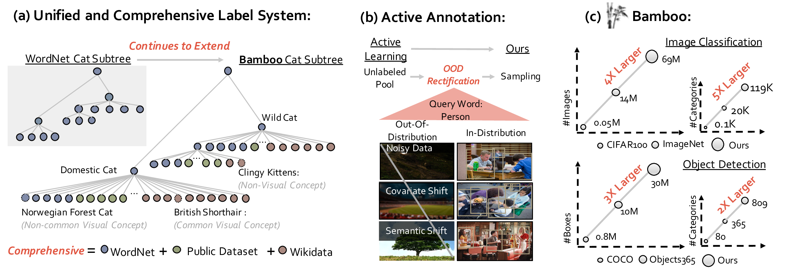

## Bamboo: Building Mega-Scale Vision Dataset Continually with Human-Machine Synergy

> Abstract: Large-scale datasets play a vital role in computer vision. Existing datasets are either collected according to heuristic label systems or annotated blindly without differentiation to samples, making them inefficient and unscalable. How to systematically collect, annotate and build a mega-scale dataset remains an open question. In this work, we advocate building a high-quality vision dataset actively and continually on a comprehensive label system.
Specifically, we contribute \textbf{\Datasetname~Dataset}, a mega-scale and information-dense dataset for both classification and detection. 
It is built upon this human-machine synergy with two appealing properties:
**1) Label System:** we integrate categories from 24 public datasets and collect 170,586 new categories from knowledge bases, forming a hierarchical label system with 304,048 categories. The label system is easily extendable under our designed hierarchy, and its concepts are further distinguished as ''visual'' or ''non-visual''.
**2) Active Annotation:** based on a real-world data pool of 370M raw images crawled by the label system, only informative samples are selected for manual labeling through our human-machine active annotation framework. We find that rectifying out-of-distribution samples is crucial for active learning to function in realistic scenarios.
Bamboo aims to populate these comprehensive categories with 24 image classification annotations and 170,586 object bounding box annotations. 
Compared to ImageNet22K and Objects365, models pre-trained on Bamboo achieve superior performance among various downstream tasks (6.2% gains on classification and 2.1% gains on detection). In addition, we provide valuable observations regarding large-scale pre-training from over 1,000 experiments.
Due to its scalable nature on both label system and annotation pipeline, Bamboo will continue to grow and benefit from the collective efforts of the community, which we hope would pave the way for more general vision models. 

