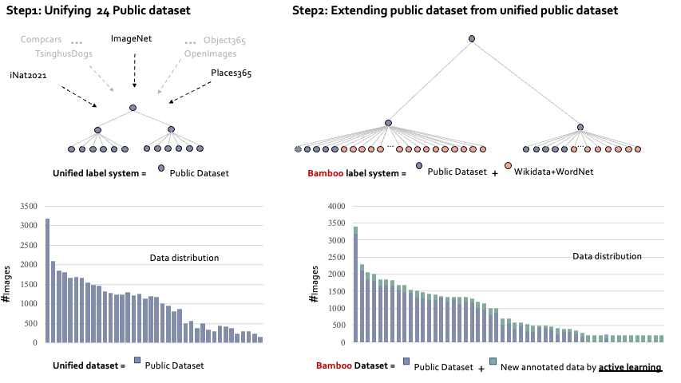
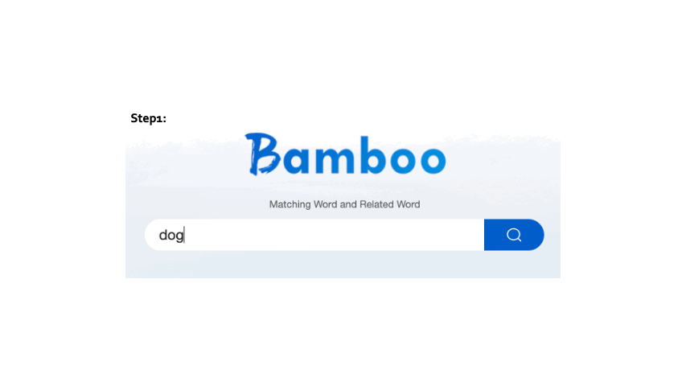

<div align="center">

<div>
    <a href='https://davidzhangyuanhan.github.io/' target='_blank'>Yuanhan Zhang</a><sup>1</sup>&emsp;
    <a href='https://github.com/Davidzhangyuanhan/Bamboo' target='_blank'>Qinghong Sun</a><sup>2</sup>&emsp;
    <a href='https://github.com/Davidzhangyuanhan/Bamboo' target='_blank'>Yichun Zhou</a><sup>3</sup>&emsp;
    <a href='https://github.com/Davidzhangyuanhan/Bamboo' target='_blank'>Zexin He</a><sup>3</sup>&emsp;
    <a href='https://scholar.google.com.hk/citations?user=ngPR1dIAAAAJ&hl=zh-CN' target='_blank'>Zhenfei Yin</a><sup>4</sup>&emsp;
    <a href='https://github.com/Davidzhangyuanhan/Bamboo' target='_blank'>Kun Wang</a><sup>4</sup>&emsp; <br>
    <a href='https://lucassheng.github.io/' target='_blank'> Lv Sheng</a><sup>3</sup>&emsp;
    <a href='http://mmlab.siat.ac.cn/yuqiao' target='_blank'>Yu Qiao</a><sup>5</sup>&emsp;
    <a href='https://amandajshao.github.io/' target='_blank'>Jing Shao</a><sup>4</sup>&emsp;
    <a href='https://liuziwei7.github.io/' target='_blank'>Ziwei Liu</a><sup>1</sup>
</div>
<div>
    <sup>1</sup>S-Lab, Nanyang Technological University&emsp;
    <sup>2</sup>Beijing University of Posts and Telecommunication&emsp; <br>
    <sup>3</sup>Beihang University&emsp;
    <sup>4</sup>SenseTime Research&emsp;
    <sup>5</sup>Shanghai AI Laboratory
</div>

<br>



<h3>TL;DR</h3>


Bamboo is a mega-scale and information-dense dataset for classification and detection pre-training. It is built upon integrating 24 public datasets (e.g. ImagenNet, Places365, Object365, OpenImages) and added new annotations through active learning. Bamboo has 69M image classification annotations (<span style="color:#AE2011">**4 times larger than ImageNet**</span>) and 32M object bounding boxes (<span style="color:#AE2011">**2 times larger than Object365**</span>).


---

<div>
    <a href='https://arxiv.org/abs/2203.07845' target='_blank'>[Paper]</a>•
    <a href='https://opengvlab.shlab.org.cn/bamboo/home' target='_blank'>[Project]</a>
</div>
</div>

## Leaderboard
[](https://paperswithcode.com/sota/image-classification-on-dtd?p=bamboo-building-mega-scale-vision-dataset) :partying_face:!\
[](https://paperswithcode.com/sota/image-classification-on-food-101-1?p=bamboo-building-mega-scale-vision-dataset) :partying_face:!\
[](https://paperswithcode.com/sota/fine-grained-image-classification-on-sun397?p=bamboo-building-mega-scale-vision-dataset)\
[](https://paperswithcode.com/sota/image-classification-on-flowers-102?p=bamboo-building-mega-scale-vision-dataset)\
[](https://paperswithcode.com/sota/fine-grained-image-classification-on-caltech?p=bamboo-building-mega-scale-vision-dataset)\
[](https://paperswithcode.com/sota/fine-grained-image-classification-on-oxford-1?p=bamboo-building-mega-scale-vision-dataset) \
[](https://paperswithcode.com/sota/image-classification-on-cifar-100?p=bamboo-building-mega-scale-vision-dataset)\
[](https://paperswithcode.com/sota/fine-grained-image-classification-on-stanford?p=bamboo-building-mega-scale-vision-dataset)\
[](https://paperswithcode.com/sota/image-classification-on-cifar-10?p=bamboo-building-mega-scale-vision-dataset)

## Updates
[06/2022] We split Bamboo-CLS into 30 datasets that represent different realms (e.g. car, mammals, food and etc.) in the natural worlds: [HERE](./superclass/README.md) \
[06/2022] Try out the web demo on Huggingface spaces 🤗: [](https://huggingface.co/spaces/CVPR/Bamboo_ViT-B16_demo). \
[06/2022] We release Bamboo-CLS with FC layer, it can classify 115,217 categories. \
[06/2022] We release our label system with many useful attributes!. \
[03/2022] Bamboo-CLS ResNet-50 and Bamboo-CLS ViT B/16 have been **released**. \
[03/2022] [arXiv](https://arxiv.org/abs/2203.07845) paper has been **released**.

## About Bamboo

### Explore
[Website Link](https://opengvlab.shlab.org.cn/bamboo/home)

### Downloads
- Sign up an account at [HERE](https://opengvlab.shlab.org.cn/register?redirect=/home), get the *USERNAME* for *opengvlab*.
- Send your request to opengvlab@pjlab.org.cn. The request should include your name, username and orgnization as follows. We will notify you by email as soon as possible.
    ```
    USERNANE: USERNANE(from step1)
    NAME: XXX
    ORGANIZATION: XXX (Bamboo is only for academic research and non-commercial use)
    ```

### Label sytem
We provide the hierarchy for our label system at [HERE](https://drive.google.com/file/d/1x53MYBQvRl9Ii3ahYT6chwAfJ48kMFuy/view?usp=sharing). This JSON file includes the following **attrubutes** of each concept. We hope this information will be beneficial for your research.

We take concept/class ``dog`` as an example.
- Load JSON file
    ```
    #input
    with open('PATH-TO-JSON-FILE.json') as f:
    bamboo = json.load(f)
    print(bamboo.keys())
    ```
    ```
    #output
    'father2child', 'child2father', 'id2name', 'id2desc', 'id2desc_zh', 'id2name_zh'
    ```
- Check the ``id (n02084071)`` of the ``dog`` on [HERE](https://opengvlab.shlab.org.cn/bamboo/search).
- Get the **attrubutes** you need.
    - Hypernyms ``bamboo['child2father']['n02084071']``: domestic_animals, canine.
    - Hyponyms ``bamboo['father2child']['n02084071']``: husky, griffon, shiba inu and etc.
    - Description ``bamboo['id2desc']['n02084071']``: a member of the genus Canis (probably descended from the common wolf) that has been domesticated by man since prehistoric times; occurs in many breeds.
    - Included in which public dataset ``bamboo['id2state']['n02084071']['academic']``: openimage, iWildCam2020, STL10, cifar10, iNat2021, ImageNet21K, coco, OpenImage, object365.




### Special meta file
Downloading the whole dataset might be unnecessary for most purposes. We provide meta files based on the following dimension.
- [ ] Class-wise (e.g. dog, car, boat and etc.)
- [x] Superclass-wise (e.g. animal, transportation, structure and etc.): [HERE](./superclass/README.md)


### How to download files from Google drives in the terminal?
- Install ``gdown`` 
    ```
    pip install gdown
    ```
- get the ``id`` of the files 
    Link, e.g. https://drive.google.com/file/d/1WEKQ_68Y9i9FzakvPYU6Yj5SOvkZCIEm/view?usp=sharing \
    id: 1WEKQ_68Y9i9FzakvPYU6Yj5SOvkZCIEm
- Download 
    ```
    gdown https://drive.google.com/uc?id=1WEKQ_68Y9i9FzakvPYU6Yj5SOvkZCIEm
    ```


## Model Zoo

### Bamboo-CLS
| Model     | Link                                                                                         | Data       | cifar10 | cifar100 | food  | pet   | flower | sun   | stanfordcar | dtd   | caltech | fgvc-aircraft | AVG       |
|-----------|----------------------------------------------------------------------------------------------|------------|---------|----------|-------|-------|--------|-------|-------------|-------|---------|---------------|-----------|
| ResNet-50 | Official                                                                                     | CLIP       |    88.7 |     70.3 |  86.4 |  88.2 |   96.1 |  73.3 |        78.3 |  76.4 |    89.6 |          49.1 | 79.64     |
| ViT B/16  | Official                                                                                     | CLIP       |    96.2 |     83.1 |  92.8 |  93.1 |   98.1 |  78.4 |        86.7 |  79.2 |    94.7 |          59.5 | 86.18     |
| ResNet-50 | [link](https://drive.google.com/file/d/1DrNT5gTK5ouB9c4VMzYpPuAFt-GWA9z3/view?usp=sharing) | Bamboo-CLS | 93.6   | 81.7    | 85.6 | 93.0 | 99.4  | 71.6 | 92.3       | 78.2 | 93.6   | 84.4          | **87.33** |
| ViT B/16  | [link](https://drive.google.com/file/d/1JNyx81QfB5Fkrho6tBCFqoUYI-VLEvX6/view?usp=sharing) [link_with-FC](https://drive.google.com/file/d/1JNyx81QfB5Fkrho6tBCFqoUYI-VLEvX6/view?usp=sharing) | Bamboo-CLS |   98.5 |    91.0 | 93.3 | 95.3 |  99.7 | 79.5 |       93.9 | 81.9 |   94.8 |          88.8 | **91.65** |


### Bamboo-DET (TBA)

## Getting Started

### Installation
```
# Create conda environment
conda create -n bamboo python=3.7
conda activate bamboo

# Install Pytorch
conda install pytorch==1.8.0 torchvision==0.9.0 cudatoolkit=10.2 -c pytorch

# Clone and install
git clone https://github.com/Davidzhangyuanhan/Bamboo.git
```
### Linear Probe
#### Step 1: 
Downloading and organizing each downstream dataset as follows

```
data
├── flowers
│   ├── train/
│   ├── test/
│   ├── train_meta.list
│   ├── test_meta.list
```
#### Step 2: 
Changing root and meta in ``Bamboo-Benchmark/configs/100p/config_\*.yaml``

#### Step 3:
Writing the path of the downloaded/your model config in ``Bamboo-Benchmark/configs/models_cfg/\*.yaml``

#### Step 4:
Writing the name of the downloaded/your model in ``Bamboo-Benchmark/multi_run_100p.sh``

#### Step 5:
``sh Bamboo-Benchmark/multi_run_100p.sh``

## Citation
If you use this code in your research, please kindly cite the following papers.

```
@misc{zhang2022bamboo,
      title={Bamboo: Building Mega-Scale Vision Dataset Continually with Human-Machine Synergy}, 
      author={Yuanhan Zhang and Qinghong Sun and Yichun Zhou and Zexin He and Zhenfei Yin and Kun Wang and Lu Sheng and Yu Qiao and Jing Shao and Ziwei Liu},
      year={2022},
      eprint={2203.07845},
      archivePrefix={arXiv},
      primaryClass={cs.CV}
}
```

## Acknowledgement

Thanks to Siyu Chen (https://github.com/Siyu-C) for implementing the Bamboo-Benchmark.


<div align="center">


</div>